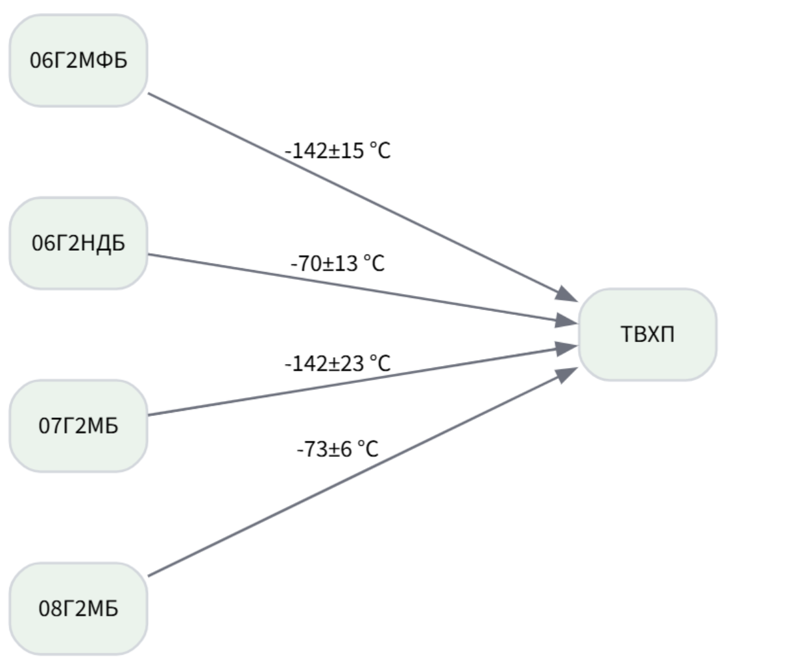
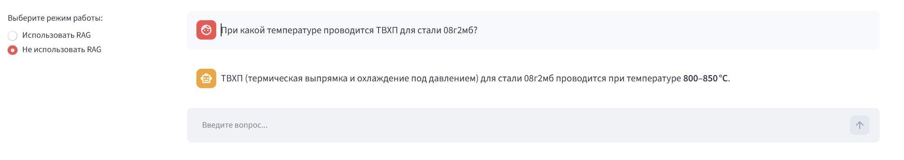
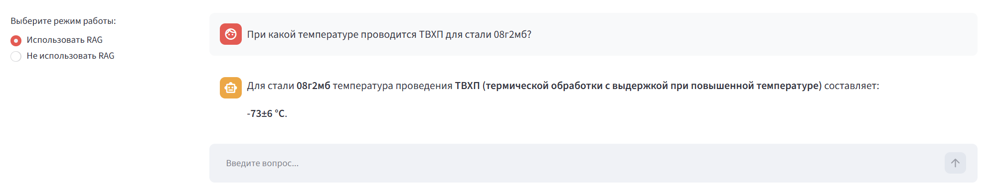
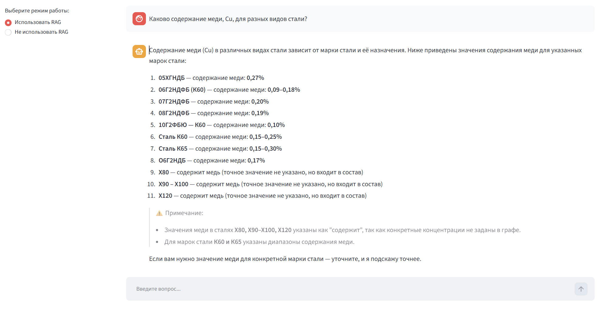
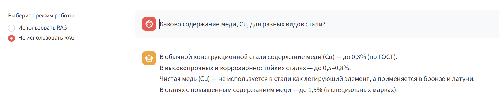

# Использование данных извлеченных из таблиц для LLM с помощью RAG

Streamlit-приложение для вызова LLM с реализацией RAG и без. В качестве модели используется [Qwen/Qwen3-8B-GGUF](https://huggingface.co/Qwen/Qwen3-8B-GGUF), а именно **Q5_K_M.gguf**. В качестве графа используется результат извлечения информации из таблиц.

Результаты тестирования выполнения запросов лежат в файлк ```test results.xlsx```
## Возможности

- Загрузка графа. Извлеченный из таблиц граф: ```neo4j_graph_export.json```
- Отображение графа
- Выполнение запросов к LLM с использованием RAG И без

## Структура проекта

- `app.py` - интерфейс Streamlit и интеграция с БД/графом/LLM.
- `rag_extraction.py` - поиск информации по графу и запросы к LLM
- `docker-compose.yml` - сервисы PostgreSQL + Neo4j.
- `infra/postgres/init.sql` - инициализация схемы PostgreSQL.
- `scripts/load_triplets.py` - CLI-загрузчик JSON в PostgreSQL + Neo4j.
- `requirements.txt` - зависимости приложения.

## Требования

- Python 3.10+ (рекомендуется 3.12)
- Docker Desktop (для PostgreSQL + Neo4j)
- Windows PowerShell (команды ниже в синтаксисе PowerShell)

## Запуск проекта

### 1) Перейти в папку проекта

```powershell
cd C:\Users\user\PycharmProjects\RAG
```

### 2) Создать виртуальное окружение и установить зависимости

```powershell
python -m venv .venv
.\.venv\Scripts\Activate.ps1
pip install -r requirements.txt
```

Если PowerShell блокирует активацию:

```powershell
Set-ExecutionPolicy -Scope Process -ExecutionPolicy Bypass
```

### 3) Запустить базы данных

```powershell
docker compose up -d
```

Параметры сервисов:

- PostgreSQL: `127.0.0.1:5433`
  - БД: `triplets`
  - Пользователь: `triplets_user`
  - Пароль: `triplets_pass`
- Neo4j:
  - Browser: `http://localhost:7474`
  - Bolt: `bolt://localhost:7687`
  - Пользователь: `neo4j`
  - Пароль: `neo4jpass`

### 4) Запустить Streamlit

```powershell
streamlit run app.py
```

Обычно приложение открывается по адресу: `http://localhost:8501`

## Как пользоваться

0. Загрузить граф на вкладке **graph viewer**
1. На левой части экрана выбрать либо отображение графа, либо работу с LLM
2. Для LLM выбрать режим RAG/no RAG.
3. Задать вопрос к локальной LLM в правой части экрана.
4. Посмотрите граф в блоке **graph viewer**.


## Остановка сервисов

```powershell
docker compose down
```

С удалением томов/данных:

```powershell
docker compose down -v
```

## Оценка графа

Для примера тестирования системы был взят следующий подграф:


Выполнение запроса без RAG:



Выполнение запроса с RAG:


Зпрос для нескольких вершин и связей с RAG (от вершин с видом стали к вершине Cu, то есть связь = количество меди)


Аналогичный вопрос без поиска вершин графа

